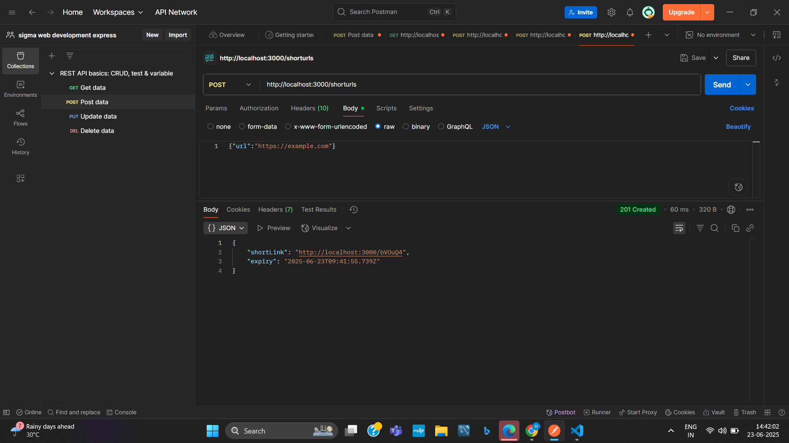
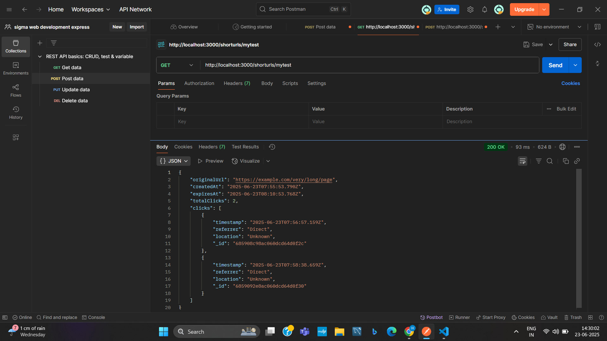

# # 🔗 URL Shortener Microservice

A lightweight and extensible URL shortener service built with **Node.js**, **Express**, and **MongoDB**. It supports custom shortcodes, link expiry, redirection tracking (with location), and custom logging middleware.

---

## 🚀 Features

- ✅ Shorten long URLs with optional custom shortcodes
- ⏳ Set expiry for each shortened link (default: 30 minutes)
- 🌍 Track clicks with timestamp, referrer, and IP-based location
- 📋 Logs all incoming requests using a custom middleware
- ⚙️ MongoDB-backed storage using Mongoose
- 🔐 Unique shortcodes with validation
- 📤 JSON API interface

---

## 📁 Project Structure

├── app.js # Main server setup
├── models/
│ └── ShortUrl.js # Mongoose schema for short URLs
├── routes/
│ └── shorturls.js # POST/GET endpoints for short URLs
├── controllers/
│ └── urlController.js # Business logic
├── middleware/
│ └── logger.js # Custom request logger middleware
├── .gitignore
└── README.md

📬 API Endpoints
➕ POST /shorturls
Shortens a long URL with optional custom shortcode and validity.

Request:

json
Copy
Edit
{
  "url": "https://example.com",
  "shortcode": "custom123",  // optional
  "validity": 60             // optional (in minutes)
}
Response:

json
Copy
Edit
{
  "shortLink": "http://localhost:3000/custom123",
  "expiry": "2025-06-23T09:41:55.739Z"
}

📸 

🔁 GET /:code
Redirects the user to the original long URL if the code is valid and not expired.

If expired: returns HTTP 410

If not found: returns HTTP 404

📊 GET /shorturls/:code
Returns full details of the shortened URL, including total clicks and click metadata (timestamp, referrer, location).

📸 
